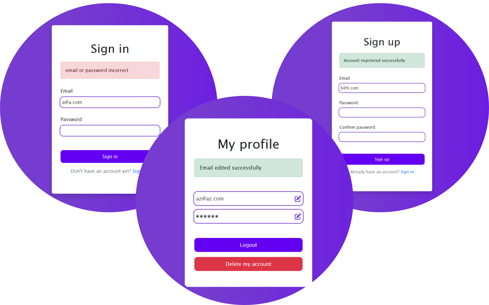

# Java Spring Boot Project using Thymeleaf



## Table of Contents

- [About the Project](#about-the-project)
- [Built With](#built-with)
- [Explanation](#explanation)
- [Run the Project](#run-the-project)
- [Clone the Repo](#clone-the-repo)
- [Contact](#contact)


## About-the-project

This is a spring boot project building an server connected to a database postgresql allowing crud operations on his user account (register, login, update and delete).

Using Thymeleaf for the frontend.

## 🛠 Built with

* 
* 
* 
* 
* 
* 

## Explanation
You can use these urls:
* https://localhost:8080/login to sign in
* https://localhost:8080/register to sign up
* https://localhost:8080/ to access to your profile

:warning: : you can use these urls after running the project with docker (see the next point "Run the project")

## Run the project
Atfer cloning the repository, you just have to type the following 2 commands (in the root of the project):

    docker-compose build
    
    docker-compose up -d
    
:warning: : you must have dcoker installed in your machine, if not:
* [Install docker for windows](https://docs.docker.com/desktop/install/windows-install/)
* [Install docker for mac](https://docs.docker.com/desktop/install/mac-install/)
* [Install docker for linux](https://docs.docker.com/desktop/install/linux-install/)

:warning: : don't forget to add the environment path for docker after installing:
* Windows
    Powershell:
    ```gitbash
    set Path=%Path%;C:\Program Files\Docker\Docker\resources\bin
    ```
* Linux
    bash:
    ```gitbash
    echo 'export PATH="/usr/local/bin:$PATH"' >> ~/.bashrc && source ~/.bashrc
    ```
* Mac
    bash:
    ```gitbash
    echo 'export PATH="/usr/local/bin:$PATH"' >> ~/.bash_profile && source ~/.bash_profile
    ```
Restart the machine and verify with: docker --version

## Clone the repo

* Clone the repository:
    ```gitbash
    git clone git@github.com:ElmiriYounes/JavaSpringBootCRUD.git
    ```

## Contact

El miri younes - elmiri.younes@hotmail.com